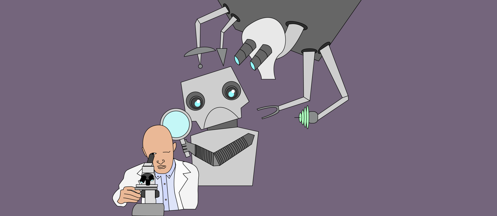
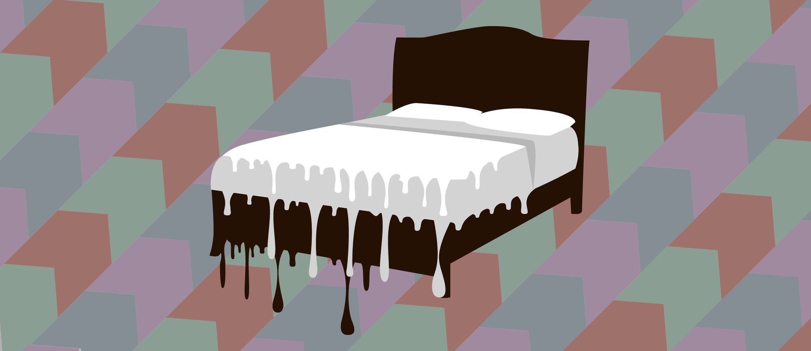

 
<h3>Here are blog posts I've written for Knowing Neurons, a neuroscience education website run by volunteer PhD students and post-docs.
 
 

[Neuro Primer: Attention](https://knowingneurons.com/2018/05/31/attention-primer/)
 
 

[Machine Yearning: The Rise of Thoughtful Machines](https://knowingneurons.com/2018/04/11/artificial-neural-network/)
 
 

[The Inescapable Nightmare of Fatal Familial Insomnia](https://knowingneurons.com/2017/10/31/fatal-familial-insomnia/)
 
 

[Neuromorphic Engineering: Biomimicry from the Brain](https://knowingneurons.com/2017/08/16/neuromorphic-engineering-biomimicry-brain/)
 
 
</h3>
